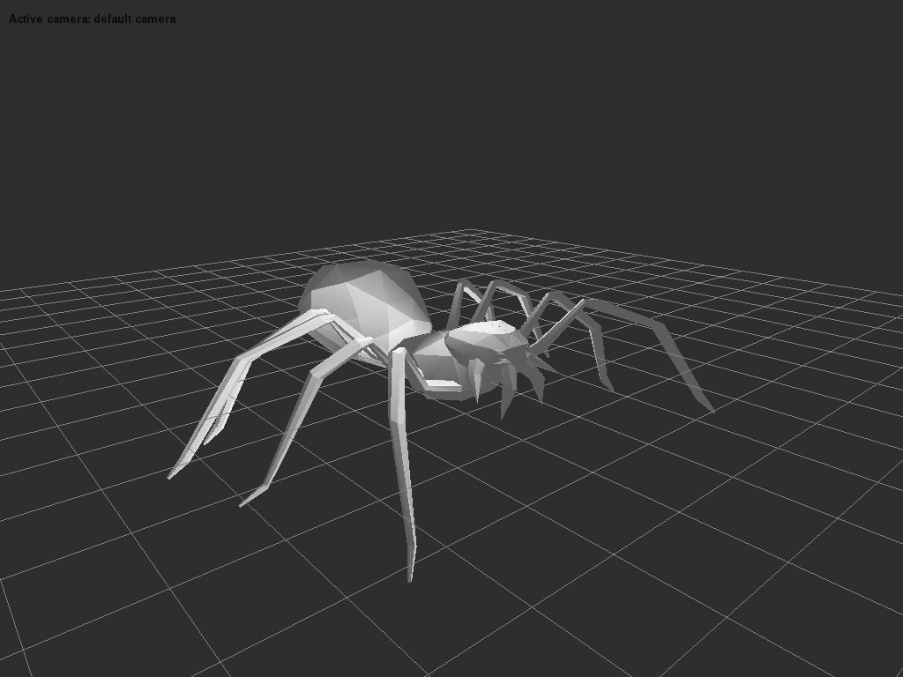

Impasse Readme
===============

 [](https://codecov.io/gh/SaladDais/Impasse)

A simple Python wrapper for [Assimp](https://github.com/assimp/assimp) using `cffi` to access the library.
Requires Python >= 3.7.

It's largely based on [PyAssimp](https://github.com/assimp/assimp/tree/master/port/PyAssimp),
Assimp's official Python port. In contrast to PyAssimp, it strictly targets modern Python 3 and
provides type hints. It also aims to allow mutating scenes before exporting by having
all wrapper classes operate directly on the underlying C data structures.

Note that impasse is not complete. Many ASSIMP features are missing.

## Usage

### Complete example: 3D viewer

`impasse` comes with a simple 3D viewer that shows how to load and display a 3D
model using a shader-based OpenGL pipeline.



To use it:

```bash
python ./scripts/3d_viewer_py3.py <path to your model>
```

You can use this code as starting point in your applications.

### Writing your own code

To get started with `impasse`, examine the simpler `sample.py` script in `scripts/`,
which illustrates the basic usage. All Assimp data structures are wrapped using
`ctypes`. All the data+length fields in Assimp's data structures (such as
`aiMesh::mNumVertices`, `aiMesh::mVertices`) are replaced by simple python
lists, so you can call `len()` on them to get their respective size and access
members using `[]`.

For example, to load a file named `hello.3ds` and print the first
vertex of the first mesh, you would do (proper error handling
substituted by assertions ...):

```python3
from impasse import load
with load('hello.3ds') as scene:

  assert len(scene.meshes)
  mesh = scene.meshes[0]

  assert len(mesh.vertices)
  print(mesh.vertices[0])
```

Another example to list the 'top nodes' in a
scene:

```python
from impasse import load
with load('hello.3ds') as scene:

  for c in scene.root_node.children:
      print(str(c))
```

# Installing

Install `impasse` by running:

```bash
pip install impasse
```

or, if you want to install from the source directory:

```bash
pip install -e .
```

Impasse requires an assimp dynamic library (`DLL` on Windows,
`.so` on linux, `.dynlib` on macOS) in order to work. The default search directories are:
  - the current directory
  - on linux additionally: `/usr/lib`, `/usr/local/lib`,
    `/usr/lib/<CPU_ARCH>-linux-gnu`

To build that library, refer to the Assimp master `INSTALL`
instructions. To look in more places, edit `./impasse/helper.py`.
There's an `additional_dirs` list waiting for your entries.

# Performance

Impasse tries to avoid unnecessary copies or conversions of data owned by C, and most classes
are just thin layers around the underlying CFFI structs. NumPy arrays that directly map to the
underlying structs' memory are used for the coordinate structs like `Matrix4x4` and `Vector3D`.

Testing with the same `quicktest.py` script against assimp's test model directory:

## Impasse

```
** Loaded 169 models, got controlled errors for 28 files, 0 uncontrolled

real	0m1.643s
user	0m1.912s
sys	0m0.531s
```

## PyAssimp

```
** Loaded 165 models, got controlled errors for 28 files, 4 uncontrolled

real	0m7.607s
user	0m7.746s
sys	0m0.579s
```
